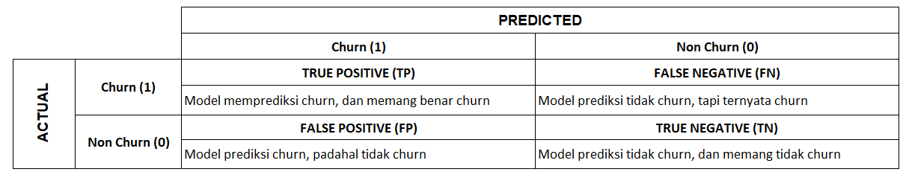
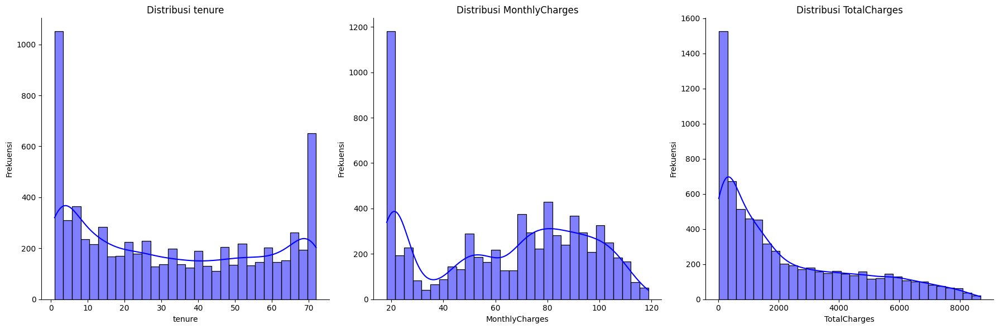
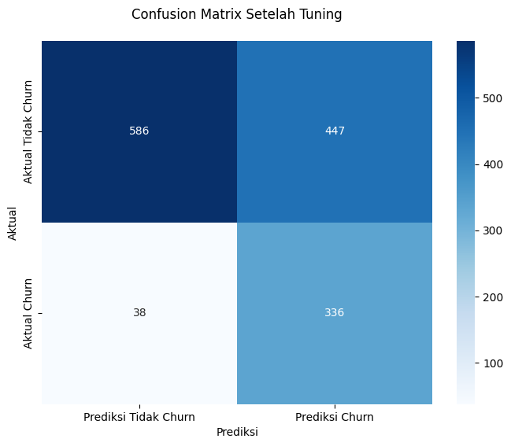

# Telco Customer Churn

### Creator Profile
    1. Rofi Rosdiani - rosdianirofi@gmail.com | [LinkedIn] 
    2. Muhammad Daffa Althaf | [LinkedIn] 

### **Content**

1. Business Problem Understanding

2. Data Understanding

3. Data Cleaning

4. Data Analysis

5. Data Preprocessing

6. Modeling and Evaluation

7. Conclusion

8. Recommendation

9. Business Implementation

## **I. Business Problem Understanding**
#### **Context**
Sebuah perusahaan telekomunikasi ingin mengidentifikasi **pelanggan yang akan berhenti berlangganan (customer churn)**, dimana **Rata-rata churn rate tahunan** dalam industri telekomunikasi mencapai **30–35%**, yang menunjukkan potensi kerugian besar jika tidak dikelola dengan baik ([Lu, 2002](https://support.sas.com/resources/papers/proceedings/proceedings/sugi27/p114-27.pdf), [King & Rice, 2019](https://www.researchgate.net/publication/343015148_Analysis_of_Churn_in_Mobile_Telecommunications_Predicting_the_Timing_of_Customer_Churn))

Untuk itu, perusahaan perlu mengetahui pelanggan mana yang berisiko churn, agar dapat diberikan intervensi atau program retensi yang tepat. Strategi ini membantu mengurangi biaya, meningkatkan efisiensi, serta menyempurnakan kualitas layanan dan perencanaan produk. Informasi terkait data pelanggan telah tersedia di perusahaan.

Target:
- 0 : Tidak churn (tetap menjadi pelanggan)
- 1 : Churn (berhenti menjadi pelanggan)

#### **Problem Statement**
Perusahaan telekomunikasi menghadapi masalah utama terkait customer churn, di mana **biaya akuisisi untuk mendapatkan pelanggan baru dapat mencapai 5 hingga 25 kali lebih besar** dibandingkan dengan mempertahankan pelanggan yang sudah ada ([Saleh & Saha, 2023](https://www.researchgate.net/publication/370129330_Customer_Churn_Prediction_in_Telecom_Industry_Using_Machine_Learning)). Oleh karena itu, perusahaan berupaya **mengurangi biaya akuisisi** dengan meningkatkan retensi pelanggan, yaitu melalui identifikasi pelanggan yang berisiko melakukan churn agar dapat diberikan program retensi yang lebih tepat sasaran.

Namun, apabila program retensi diterapkan kepada seluruh pelanggan tanpa seleksi, maka biaya yang dikeluarkan justru akan menjadi tidak efisien karena juga mencakup pelanggan yang sudah loyal dan tidak berisiko churn.

#### **Goals**

Berdasarkan permasalahan tersebut, perusahaan ingin memiliki **kemampuan untuk memprediksi kemungkinan seorang pelanggan akan melakukan churn atau tidak**, sehingga perusahaan dapat **menghindari biaya akuisisi pelanggan baru yang sangat besar** melalui peningkatan efektivitas program retensi.

Selain itu, perusahaan juga ingin mengetahui **faktor-faktor atau variabel-variabel yang memengaruhi keputusan pelanggan untuk melakukan churn**, agar manajemen dapat menyusun strategi yang lebih tepat sasaran dalam mempertahankan pelanggan, sekaligus mengurangi kebutuhan akan akuisisi pelanggan baru.

#### **Analytic Approach**

Analisis data yang dilakukan untuk menemukan pola-pola yang membedakan pelanggan yang melakukan churn dan yang tidak (loyal).
Selanjutnya, akan dibangun model klasifikasi yang dapat membantu perusahaan memprediksi probabilitas seorang pelanggan akan melakukan churn (berhenti berlangganan) atau tidak (tetap loyal).

Oleh karena itu, proses pemodelan akan dilakukan menggunakan beberapa algoritma klasifikasi, seperti Logistic Regression, Decision Tree, K-Nearest Neighbors (KNN), Random Forest, XGBoost, dan LightGBM, guna membandingkan performa masing-masing model dan memilih yang paling optimal.

#### **Stakeholders yang terlibat**

Berikut adalah pihak-pihak yang memiliki peran penting dalam keberhasilan implementasi model prediksi churn pelanggan:

| **Stakeholder**                | **Peran dan Kepentingan**                                                                                     |
|--------------------------------|----------------------------------------------------------------------------------------------------------------|
| **Manajemen Eksekutif**        | Mengambil keputusan strategis berbasis data churn, seperti alokasi anggaran retensi atau pengembangan produk. |
| **Tim Pemasaran**              | Menggunakan hasil prediksi untuk membuat program retensi yang lebih terarah kepada pelanggan berisiko.        |

**Metric Evaluation**

- **True Positive (TP)** : Model memprediksi customer akan churn dan memang benar churn

- **True Negative (TN)** : Model memprediksi customer tidak akan churn dan memang tidak churn

- **Type 1 error (False Positive/FP)** : Model memprediksi customer akan churn, padahal sebenarnya tidak churn.
  - Konsekuensi : Perusahaan mengalokasikan biaya retensi (diskon, promo, insentif) kepada customer yang sebenarnya loyal. Ini menyebabkan pemborosan biaya karena strategi retensi diterapkan pada customer yang tetap akan bertahan tanpa insentif.

- **Type 2 error (False Negative/FN)** : Model memprediksi customer tidak akan churn, padahal sebenarnya churn
  - Konsekuensi : Customer yang benar-benar akan churn tidak mendapatkan perhatian atau intervensi, sehingga:
     - Customer benar-benar pergi tanpa upaya pencegahan.
     - Perusahaan kehilangan pendapatan dan harus mengeluarkan biaya akuisisi yang lebih besar untuk mencari customer baru.

Berdasarkan konsekuensinya, sebisa mungkin model yang dibangun harus dapat mengurangi biaya akuisisi (untuk mendapatkan pelanggan baru) perusahaan, namun tanpa mengorbankan jumlah pelanggan loyal yang ingin dipertahankan. Oleh karena itu, metric evaluation yang akan digunakan adalah Recall sebagai metric utama.

## **II. Data Understanding**
Permasalahan di atas akan dianalisa menggunakan dataset **Telco Customer Churn** [IBM Sample Data Sets]. Dataset ini diupload oleh BlastChar di situs kaggle pada tahun 2018 dan berisi data pelanggan yang churn dan non churn. Dataset dapat diakses [di sini.](https://www.kaggle.com/datasets/blastchar/telco-customer-churn)

**Dataset Information**

| Kolom              | Deskripsi                                                | Tipe Data Awal | Tipe Data Seharusnya |
| ------------------ | -------------------------------------------------------- | -------------- | -------------------- |
| `customerID`       | ID unik tiap pelanggan                                   | `object`       | `object` (string)    |
| `gender`           | Jenis kelamin pelanggan (`Male` / `Female`)              | `object`       | `category`           |
| `SeniorCitizen`    | Apakah pelanggan adalah warga senior (1 = ya, 0 = tidak) | `int64`        | **category**         |
| `Partner`          | Apakah pelanggan memiliki pasangan                       | `object`       | `category`           |
| `Dependents`       | Apakah pelanggan memiliki tanggungan                     | `object`       | `category`           |
| `tenure`           | Lama berlangganan (dalam bulan)                          | `int64`        | `int64`              |
| `PhoneService`     | Apakah pelanggan berlangganan layanan telepon            | `object`       | `category`           |
| `MultipleLines`    | Apakah pelanggan memiliki lebih dari satu jalur telepon  | `object`       | `category`           |
| `InternetService`  | Jenis layanan internet                                   | `object`       | `category`           |
| `OnlineSecurity`   | Layanan keamanan online                                  | `object`       | `category`           |
| `OnlineBackup`     | Layanan pencadangan online                               | `object`       | `category`           |
| `DeviceProtection` | Proteksi perangkat                                       | `object`       | `category`           |
| `TechSupport`      | Dukungan teknis                                          | `object`       | `category`           |
| `StreamingTV`      | Layanan streaming TV                                     | `object`       | `category`           |
| `StreamingMovies`  | Layanan streaming film                                   | `object`       | `category`           |
| `Contract`         | Jenis kontrak                                            | `object`       | `category`           |
| `PaperlessBilling` | Apakah pelanggan menggunakan tagihan tanpa kertas        | `object`       | `category`           |
| `PaymentMethod`    | Metode pembayaran                                        | `object`       | `category`           |
| `MonthlyCharges`   | Biaya bulanan                                            | `float64`      | `float64`            |
| `TotalCharges`     | Total biaya yang telah dibayarkan                        | `object`       | **float64**          |
| `Churn`            | Status churn                                             | `object`       | `category`           |

## **III. Data Cleaning**

- Pengecekan Data Duplikat

- Pengecekan Missing Values

- Pengecekan Tipe Data dan Invalid Data
  - Pengecekan dan Handling Data pada Variable Tenure (Drop 11 baris data dengan `tenure = 0`)

- Pengecekan dan Handling Data pada Variable TotalCharge

- Pengecekan Outliers

- Pengecekan Features Numerikal dan Kategorikal

## **IV. Data Analysis**
1. Pengecekan Korelasi Seluruh Fitur
    - Pengecekan Korelasi Numerikal Fiture dengan heatmap correlation
    - Pengecekan Korelasi Numerikal Fiture dengan VIF
    - Pengecekan Korelasi Kategorikal Fiture dengan VIF
    - Pengecekan ulang Multikolinearitas dengan Chi Square
    - Validasi Hasil Chi-Square terhadap VIF
    - Penanganan VIF sbb:
      - Menambah fitur baru dengan:
        - Menyederhanakan MultipleLines, fitur turunan Internet
        - Menambahkan flag HasPhone dan HasInternet
        - Menghapus PhoneService dan InternetService
        - Ubah 'No internet service' menjadi 'No' agar hanya dua kategori: Yes / No

    - Hapus satu dari pasangan yang berkorelasi tinggi, contoh: Antara MonthlyCharges dan TotalCharges, pilih salah satu.
    - Nantinya akan dibandingkan hasil model sebelum vs sesudah penanganan VIF/Multikolinearitas

2. Pengecekan Distribusi Data
Berikut merupakan visualisasi numerikal data
 

3. Bivariate Analysis (Melihat Hubungan antar Feature terhadap Target (Churn))

4. Melakukan Uji-Statistik terhadap Fiture Numerikal
    - Analisis hubungan lama berlangganan *(tenure)* terhadap kemungkinan pelanggan melakukan churn | Korelasi Spearman
    - Analisis hubungan jenis kontrak terhadap probabilitas pelanggan berhenti berlangganan *(churn)* | Korelasi Spearman
    - Analisis perbedaan signifikan rata-rata tagihan bulanan *(MonthlyCharges)* antara pelanggan yang churn dan yang tidak | Mann-Whitney U Test

## **V. Data Preprocessing**
- Feature Engineering
  - Encoding (OneHot Encoding dan Ordinal Encoding)
  - Scaling with robust scaler
  - Cek Multikolinearitas dan Handle with drop highest VIF

## **VI. Modeling and Evaluation**
Algoritma yang digunakan:

Berikut ringkasan cara kerja masing-masing algoritma klasifikasi:

**1. Logistic Regression** :
Menghitung kombinasi linier dari fitur dan mengubahnya menjadi probabilitas dengan fungsi sigmoid. Klasifikasi ditentukan berdasarkan threshold (biasanya 0.5).

**2. K-Nearest Neighbors (KNN)** : 
Mengklasifikasikan data baru berdasarkan mayoritas kelas dari K tetangga terdekat berdasarkan jarak (misalnya Euclidean).

**3. Decision Tree** : 
Membagi data secara berulang menggunakan fitur yang paling memisahkan label (berdasarkan Gini atau Entropy) hingga mencapai keputusan di daun.

**4. Random Forest** : 
Membangun banyak decision tree dari subset acak data dan fitur, lalu menggabungkan hasilnya dengan voting mayoritas.

**5. XGBoost** : 
Membangun pohon keputusan secara bertahap. Setiap pohon baru memperbaiki error dari pohon sebelumnya dengan optimasi berbasis gradient boosting.

**6. LightGBM** : 
Mirip XGBoost tapi lebih efisien. Menggunakan pendekatan leaf-wise dan teknik optimasi untuk mempercepat proses training dan mengurangi penggunaan memori.

**Berikut pemodelan yang akan dilakukan** : 
1. Model tanpa vs dengan seleksi fitur : LogReg, KNN, Decision Tree, Random Forest, XGBoost, LightGBM
2. Model tanpa seleksi fitur : Logistic Regresion

Penanganan Data Imbalance : Logistic Regresion
- Penerapan regularisasi L1 pada model Logistic Regression
- Oversampling with K-Fold, using SMOTE
- Undersampling dengan RandomUnderSampler (10-Fold CV)
- Hybrid Sampling Using SMOTE + Tomek Links
- Penalized Model
- Pemilihan teknik: Hybrid Sampling Using SMOTE + Tomek Links

Hyperparameter Tuning with Grid Search : Logistic Regresion

#### **Final Model : Logistic Regresion after tuning with scaling dan Hybrid (SMOTETomek)**

Best Parameters: {'clf__C': 0.001, 'clf__max_iter': 300, 'clf__penalty': 'l1', 'clf__solver': 'saga'}
Recall: 0.8983

 

Informasi dari confusion matrix pada test set :
- Jumlah customer yang aktualnya churn dan diprediksi akan melakukan churn **(True Positive)** : 336 orang
- Jumlah customer yang aktualnya churn tetapi diprediksi tidak akan melakukan churn **(False Negative)** : 38 orang
- Jumlah customer yang aktualnya tidak churn dan diprediksi tidak akan churn **(True Negative)** : 586 orang
- Jumlah customer yang aktualnya tidak churn tetapi diprediksi akan churn **(False Positive)** : 447 orang
- Jumlah customer yang diprediksi akan churn sebanyak 336 + 447 = 783 orang
- Jumlah customer yang diprediksi tidak akan churn sebanyak 38 + 586 = 624 orang

#### **Feature Coefficients** 

**Analisis Odds Ratio Churn Pelanggan**

| No | Fitur | Coefficient | OR | Persentase Pengaruh | Interpretasi |
|----|-------|------------|----|---------------------|--------------|
| 1 | InternetService_Fiber optic | 0.844 | 2.33 | +133% | Paling meningkatkan churn |
| 2 | InternetService_No | -0.821 | 0.44 | -56% | Protektif kuat |
| 3 | TotalCharges | 0.647 | 1.91 | +91% | Semakin besar tagihan semakin berisiko |
| 4 | PaperlessBilling_Yes | 0.446 | 1.56 | +56% | Signifikan meningkatkan risiko |
| 5 | Payment_Electronic check | 0.334 | 1.40 | +40% | Pembayaran elektronik berisiko |
| 6 | StreamingTV_Yes | 0.332 | 1.39 | +39% | Sedikit meningkatkan risiko |
| 7 | StreamingMovies_Yes | 0.270 | 1.31 | +31% | Pengaruh moderat |
| 8 | MultipleLines_Yes | 0.198 | 1.22 | +22% | Pengaruh kecil |
| 9 | SeniorCitizen_Yes | 0.111 | 1.12 | +12% | Minor meningkatkan risiko |
| 10 | Partner_Yes | -0.064 | 0.94 | -6% | Protektif sangat lemah |
| 11 | Payment_CreditCard | -0.092 | 0.91 | -9% | Sedikit protektif |
| 12 | DeviceProtection_Yes | -0.092 | 0.91 | -9% | Sedikit protektif |
| 13 | OnlineBackup_Yes | -0.119 | 0.89 | -11% | Protektif moderat |
| 14 | Dependents_Yes | -0.214 | 0.81 | -19% | Cukup protektif |
| 15 | TechSupport_Yes | -0.331 | 0.72 | -28% | Protektif signifikan |
| 16 | PhoneService_Yes | -0.351 | 0.70 | -30% | Protektif kuat |
| 17 | OnlineSecurity_Yes | -0.595 | 0.55 | -45% | Sangat protektif |
| 18 | Contract | -0.691 | 0.50 | -50% | Faktor protektif terkuat kedua |
| 19 | Tenure | -2.362 | 0.09 | -91% | Paling protektif |

## **VII. Conclusion**
**Kesimpulan Faktor Penentu Keputusan Churn Pelanggan**

Berdasarkan analisis Odds Ratio, berikut faktor-faktor kritis yang mempengaruhi keputusan churn:

**Faktor Risiko Tinggi (Penyebab Churn)**
1. **Layanan Fiber Optic**  
   - OR 2.33 (+133%)  
   - *Pelanggan fiber 2.3x lebih mungkin churn dibanding DSL*

2. **Total Tagihan Besar**  
   - OR 1.91 (+91%)  
   - *Tagihan tinggi berkorelasi dengan risiko churn*

3. **Paperless Billing**  
   - OR 1.56 (+56%)  
   - *Sistem tagihan digital meningkatkan kemungkinan churn*

4. **Pembayaran Elektronik**  
   - OR 1.40 (+40%)  
   - *Metode pembayaran elektronik lebih berisiko*

 **Faktor Protektif (Penahan Churn)**
1. **Lama Berlangganan (Tenure)**  
   - OR 0.09 (-91%)  
   - *Setiap tahun tambahan turunkan risiko churn 91%*

2. **Kontrak Jangka Panjang**  
   - OR 0.50 (-50%)  
   - *Kontrak 2-tahun turunkan risiko 50%*

3. **Online Security**  
   - OR 0.55 (-45%)  
   - *Layanan keamanan digital mengurangi churn*

4. **Tech Support**  
   - OR 0.72 (-28%)  
   - *Dukungan teknis efektif pertahankan pelanggan*

**Temuan Menarik**
- **Paradoks Tagihan**: Total charge tinggi justru meningkatkan churn (mungkin karena harga dirasa tidak worth it)
- **Faktor Demografi**: Senior citizen lebih rentan churn (+12%)
- **Layanan Tambahan**:  
  - Streaming (TV/Film) meningkatkan risiko  
  - Fitur keamanan (backup, device protection) bersifat protektif

## **VIII. Recommendation**

#### **Rekomendasi Bisnis**
- Perusahaan bisa **mempertahankan pelanggan** dengan cara:
  - Mendorong pelanggan untuk memilih **kontrak jangka panjang**
  - Mengkaji ulang pendekatan terhadap pelanggan yang menggunakan metode pembayaran **‘Electronic Check’**
  - Memberikan perhatian khusus pada pelanggan yang **tidak menggunakan layanan internet atau fitur tambahannya**
  - **Tingkatkan retensi pengguna fiber optic** dengan program loyalitas (e.g., bonus bandwidth).  
  - **Optimalkan pengalaman pembayaran elektronik** (e.g., notifikasi otomatis, diskon untuk autodebet).  
  - **Bundle layanan** seperti TechSupport + OnlineSecurity untuk mengurangi churn. 
  - **Program onboarding** khusus pelanggan baru (<6 bulan) untuk meningkatkan engagement.  
  - Evaluasi kualitas layanan fiber optic
  - Tinjau struktur harga untuk pelanggan dengan tagihan besar

#### **Rekomendasi untuk pengembangan model**
- Mencoba algorithm ML yang lain dan juga mencoba hyperparameter tuning kembali, coba gunakan teknik oversampling yang berbeda juga selain SMOTE, seperti SMOTENC, ADASYN, Cluster-Based, dsb 
- Menambahkan kolom-kolom baru yang berhubungan dengan perilaku pelanggan secara lebih mendetail, seperti:
  - Pola Pembayaran: Keterlambatan, metode, frekuensi.
  - Penggunaan Layanan: Trend pemakaian, komplain.
  - Interaksi: Riwayat hubungi CS, klik halaman berhenti berlangganan.
- Mencoba metric evaluasi lain seperti F1 Score atau F2 Score untuk melihat keseimbangan antara kelas positif dan negatif

**Limitasi Model**
- TotalCharges tidak akurat sepenuhnya, karena hasil kalkulasi manual tidak sesuai — kemungkinan ada biaya tambahan yang tidak tersedia di dataset.
- Informasi perilaku pelanggan masih terbatas, seperti riwayat komplain, keterlambatan pembayaran, atau alasan berhenti.
- Model bersifat statis, belum mempertimbangkan perubahan perilaku pelanggan dari waktu ke waktu.
- Kemungkinan relasi non-linear tidak ditangkap dengan baik karena model utama yang digunakan adalah Logistic Regression. Artinya: Model Logistic Regression hanya mampu menangkap hubungan linear antara fitur dan target (churn/tidak churn).
Jika ada pola hubungan non-linear (misalnya, efek gabungan atau pengaruh tidak langsung antar fitur), maka Logistic Regression mungkin tidak bisa mengenalinya dengan baik, sehingga akurasi model bisa menurun.
- Ketidakseimbangan data tetap bisa memengaruhi performa meskipun sudah dilakukan penanganan.

## **VII. Business Implementation**

**Implementasi rekomendasi bisnis secara komprehensif untuk mempertahankan pelanggan dan mengurangi dampak biaya akuisisi**:

##### **Strategi Bisnis**

**1. Kontrak & Retensi Jangka Panjang**  
- **Strategi:**  
  - Mendorong pelanggan beralih dari *kontrak bulanan* (month-to-month) ke *kontrak jangka panjang* (1/2 tahun) dengan:
    - Berikan **diskon 10-15%** untuk pelanggan yang memilih kontrak 1 atau 2 tahun vs bulanan
  - **"Loyalty Tier"**: Hadiah tambahan (free upgrade speed) untuk pelanggan yang renew kontrak  
  - **Early Renewal Incentive**: Bonus bulan gratis jika perpanjang kontrak 3 bulan sebelum berakhir  

**2. Mitigasi Risiko Pembayaran Elektronik**  
- **Problem:** Metode ini OR +40% (tinggi)  
- **Solusi:**  
  - **Auto-debet discount**: Berikan cashback 5% untuk migrasi ke credit card/bank transfer  
  - **Payment Reminder**: SMS/WhatsApp 3 hari sebelum jatuh tempo untuk electronic check  
  - **"On-Time Payment Reward"**: Poin loyalitas untuk yang bayar tepat waktu  

**3. Strategi Fiber Optic**  
- **Problem:** OR tertinggi (+133%)  
- **Action Plan:**  
  - **Quality Assurance**: Audit rutin kecepatan jaringan fiber vs promosi  
  - **Value-Added Service**: Bundling gratis Netflix/Spotify 3 bulan untuk pengguna fiber  
  - **Exit Interview**: Survei khusus pelanggan fiber yang churn untuk identifikasi akar masalah  

**4. Program Tenure Booster**  
- **Fokus:** Pelanggan baru (tenure <6 bulan)  
- **Strategi:**  
  - **Onboarding Specialist**: Tim khusus pendampingan 3 bulan pertama  
  - **"First Year Challenge"**: Hadiah cashback jika bertahan 12 bulan  
  - **Usage Alert**: Notifikasi jika ada penurunan penggunaan (early warning churn)  

**5. Bundling Protektif**  
- **Paket "Anti-Churn"**:  
  - Tech Support + Online Security diskon 30%  
  - Tambah Device Protection gratis 3 bulan 

**Asumsi:**

**Analisis Dampak Finansial: Model Prediksi Churn vs. Tanpa Intervensi**  
*Estimasi Penghematan hingga 88% dengan Machine Learning*

**Asumsi Dasar**  
| Metric | Nilai |  
|--------|-------|  
| Total pelanggan (data test) | 1.407 |  
| Pendapatan per pelanggan/bulan | \$64.76 |  
| Biaya akuisisi pelanggan baru | \$140 |  
| Biaya retensi per pelanggan | \$7 |  

- **Skenario 1: Tanpa Model Prediksi**  
**Churn Rate:** 27% (≈380 pelanggan)  

| Konsekuensi | Perhitungan | Total |  
|-------------|-------------|-------|  
| Kehilangan pendapatan tahunan | 380 × \$64.76 × 12 | **\$295,305** |  
| Biaya akuisisi pengganti | 380 × \$140 | **\$53,200** |  
| **Total kerugian tahunan** | | **\$348,505** |  

- **Skenario 2: Dengan Model Prediksi**  
    **Hasil Klasifikasi Model:**  
    - **False Negative (FN):** 38 pelanggan churn (tidak terdeteksi)  
    - **False Positive (FP):** 447 pelanggan loyal (terdeteksi salah)  

| Biaya | Perhitungan | Total |  
|-------|-------------|-------|  
| Kehilangan pendapatan (FN) | 38 × \$64.76 × 12 | **\$29,530** |  
| Biaya akuisisi (FN) | 38 × \$140 | **\$5,320** |  
| Biaya retensi (TP + FP) | (336 + 447) × \$7 | **\$5,481** |  
| **Total biaya dengan model** | | **\$40,331** |  

**Dampak Finansial**

Dengan menggunakan model prediksi churn, perusahaan dapat:

* **Menghemat hingga \$308.174 per tahun (88%)**
* **Mengurangi jumlah pelanggan yang churn** secara signifikan:
  dari 380 menjadi hanya 38 pelanggan
* **Meningkatkan efisiensi biaya retensi**, dengan hanya 783 pelanggan yang menerima promosi (dibandingkan seluruh basis pelanggan)

Walaupun masih terdapat **447 pelanggan loyal** yang salah diklasifikasikan dan menimbulkan **pemborosan biaya retensi sebesar \$3.129**, angka ini jauh lebih kecil dibandingkan kerugian dalam skenario tanpa model.

## **Tableau Dashboard**
[Link Tableau Dashboard]()

Berikut merupakan tampilan Tableau Dashboard.

Note: Preview bisa berbeda bergantung masing-masing perangkat saat mengakses Tableau (Not 100% fit)
